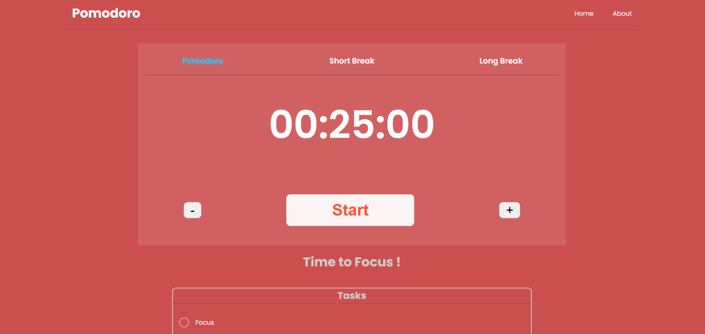
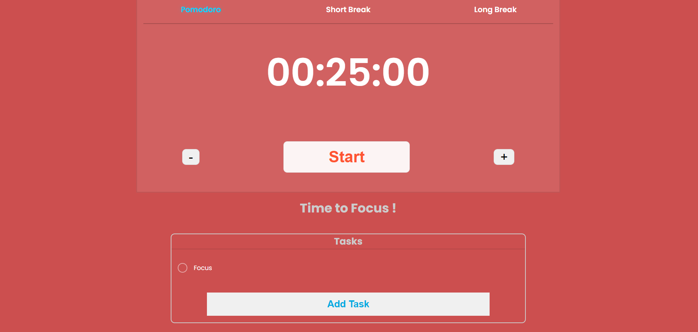

<h1 align="center">Pomodoro Timer Web</h1>

<p align="center">
一個基於 React + TypeScript 的番茄鐘網頁
</p>

<div align="center">


[](LICENSE) <br>

</div>

## 項目簡介

**Pomodoro Timer Web** 是一個現代化、美觀且直覺的番茄鐘（Pomodoro）網頁應用。它旨在透過清爽的介面與流暢的交互，幫助使用者更專注於當前的任務。

## ✨ 主要功能

- 🕒 **計時器**：穩定的計時引擎，支持啟動、暫停與重置。
- 🔄 **模式切換**：預設封裝了三種模式：
  - **Pomodoro (25 min)**：核心專注時間。
  - **Short Break (5 min)**：短暫休息。
  - **Long Break (15 min)**：深度放鬆。
- ➕ **手動微調**：提供快速加減時間按鈕，隨時根據需求調整專注長度。
- 📝 **任務管理**：內建簡潔的任務列表，追蹤待辦事項。

## 🚀 快速開始

### 1. 安裝依賴
```bash
npm install
```

### 2. 啟動開發伺服器
```bash
npm run dev
```

### 3. 建置生產環境版本
```bash
npm run build
```

## 📸 介面展示 (Demo)
</img>
</img>

---

## 📜 授權條款

本專案採用 [MIT](LICENSE) 授權。